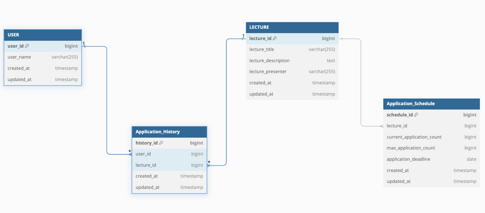

## ERD 설계 및 설명
### 1. 설계 개요
- 각 테이블은 유저, 특강, 신청 내역, 그리고 신청 스케줄과 관련된 정보들을 저장합니다. 
- 유저가 특강을 신청하고, 해당 내역을 기록하며, 스케줄에 따라 신청 가능한 상태를 관리할 수 있도록 하는 구조입니다.

### 2. 테이블 설명 및 설계 이유

#### 1) **USER (유저 테이블)**

- **시스템에 등록된 유저들의 정보를 관리하는 테이블입니다.**:
  - `user_id` (PK): 유저의 고유 식별자.
  - `user_name`: 유저의 이름.
  - `created_at`, `updated_at`: 유저 생성 및 수정 일자.

 
- 유저는 특강 신청의 주체이므로 고유한 식별자로 관리해야 하며, 신청 기록과 연동하기 위해 별도의 유저 테이블이 필요합니다.

---

#### 2) **LECTURE (특강 테이블)**

- **특강에 대한 정보를 저장하는 테이블입니다.**
  - `lecture_id` (PK): 특강의 고유 식별자.
  - `lecture_title`: 특강의 제목.
  - `lecture_description`: 특강의 설명.
  - `lecture_presenter`: 특강의 발표자.
  - `created_at`, `updated_at`: 특강 생성 및 수정 일자.

- 유저가 신청할 수 있는 특강 목록을 관리하고, 이를 신청 내역과 연결하기 위해 강의테이블을 따로 분리 하였습니다.
- 강의 정보가 바뀌여도 유연한 대처가 가능합니다.

---

#### 3) **APPLICATION_HISTORY (신청 내역 테이블)**

- **유저가 신청한 특강 내역을 저장하는 테이블입니다.**

  - `history_id` (PK): 신청 내역의 고유 식별자.
  - `user_id` (FK): 신청한 유저의 식별자.
  - `lecture_id` (FK): 신청한 특강의 식별자.
  - `created_at`, `updated_at`: 신청 내역 생성 및 수정 일자.

- 유저와 특강 간의 관계를 관리하기 위해 중간 테이블이 필요합니다. 각 유저가 신청한 특강을 기록하며, 다대다 관계를 처리하기 위한 구조로 `APPLICATION_HISTORY` 테이블을 설계했습니다.

---

#### 4) **APPLICATION_SCHEDULE (신청 스케줄 테이블)**

- **각 특강의 신청 가능 상태와 스케줄을 관리하는 테이블입니다.**

  - `schedule_id` (PK): 신청 스케줄의 고유 식별자.
  - `lecture_id` (FK): 스케줄이 관리하는 특강의 식별자.
  - `current_application_count`: 현재 신청한 인원 수.
  - `max_application_count`: 최대 신청 가능 인원 수.
  - `application_deadline`: 신청 마감 기한.
  - `created_at`, `updated_at`: 스케줄 생성 및 수정 일자.

- 특강의 신청 가능 여부를 관리하는 역할을 수행합니다. 신청 인원과 마감 기한 등을 설정해 각 특강의 신청 상태를 관리할 수 있도록 설계되었습니다.

### 3. ERD 설계의 특징
유저는 여러 개의 특강을 신청할 수 있고, 하나의 특강은 여러 유저에 의해 신청될 수 있습니다.
이를 관리하기 위해 APPLICATION_HISTORY 테이블을 중간 테이블로 도입하여 유저와 특강 간의 다대다 관계를 처리했습니다.
특강의 신청 상태를 효율적으로 관리하기 위해 별도의 APPLICATION_SCHEDULE 테이블을 설계하였습니다. 
이를 통해 신청 인원, 마감 기한 등을 관리할 수 있습니다.
